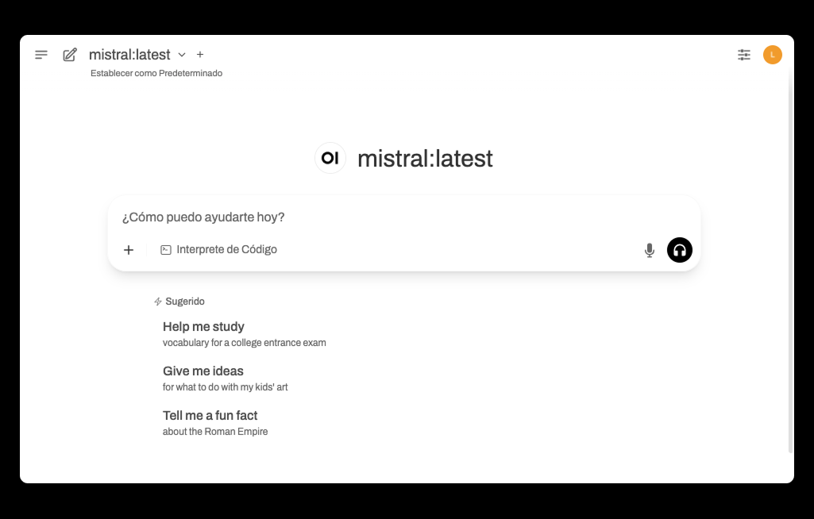

# Open WebUI - Instalación Local



Este proyecto te permite ejecutar Open WebUI con modelos locales como Mistral usando Ollama.

## Requisitos
- Python 3.12
- Node.js >= 20.18.1
- [Ollama](https://ollama.com/download)
- Git

## 1. Clona el repositorio
```sh
git clone <URL_DEL_REPOSITORIO>
cd openWebUI
```

## 2. Instala Ollama y descarga el modelo Mistral
- Descarga e instala Ollama desde [ollama.com/download](https://ollama.com/download)
- Abre una terminal y ejecuta:
```sh
ollama pull mistral
ollama run mistral
```

## 3. Crea y activa el entorno virtual
```sh
python3.12 -m venv venv312
source venv312/bin/activate  # Para activar el entorno virtual
```

## Para cerrar el entorno virtual
```sh
deactivate
```

## 4. Instala las dependencias de Python
```sh
pip install -r open-webui/backend/requirements.txt
```

## 5. Instala las dependencias de Node.js y construye el frontend
```sh
cd open-webui
npm install --legacy-peer-deps
npm run build
```

## 6. Configura las variables de entorno
Por defecto, el proyecto usa Ollama en `http://localhost:11434`. Si usas otro puerto, edita la variable en `start_webui.py`:
```python
os.environ.setdefault("OLLAMA_API_BASE", "http://localhost:11434")
```

## 7. Ejecuta el backend
```sh
cd open-webui/backend
../venv312/bin/uvicorn open_webui.main:app --host 0.0.0.0 --port 3001 --reload
```

## 8. Abre el navegador
Accede a [http://localhost:3001](http://localhost:3001) y selecciona el modelo Mistral en la interfaz.

---

## Notas
- No subas la carpeta `venv312/` ni archivos generados al repositorio (ver `.gitignore`).
- Si tienes problemas con dependencias de Node.js, usa siempre `--legacy-peer-deps`.
- Para otros modelos, consulta la documentación de Ollama.

---

¿Dudas o problemas? Consulta la [documentación oficial de Open WebUI](https://github.com/open-webui/open-webui) o únete a su Discord.
